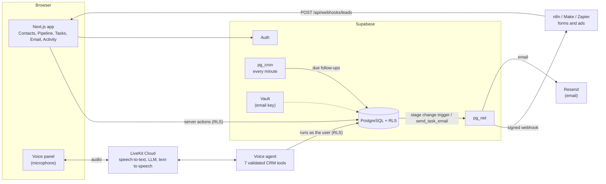

# FlowCRM

A small, polished sales CRM with one excellent workflow: talk to it.

> "Move John Smith to Qualified and create a follow-up for tomorrow at 10 AM."

FlowCRM understands that, finds the records, updates the pipeline, schedules the follow-up, and the UI updates live.

## Features

- Email/password authentication (Supabase Auth) with protected routes
- Dashboard: contact and opportunity counts, open pipeline value, stage summary, upcoming follow-ups
- Contacts: list, search, create, edit, detail view with related opportunities and tasks
- Opportunities and pipeline: Kanban columns (New → Lost) with a stage dropdown, opportunity detail page
- Follow-up tasks: create, complete, cancel; grouped as overdue / today / tomorrow / upcoming
- Realtime Voice AI assistant (LiveKit Agents + LiveKit Inference) with four structured CRM tools
- Live UI updates when the assistant changes data (Supabase Realtime)
- Activity log: every create/update/delete of contacts, deals and tasks is recorded and labeled as made by you, the Voice AI, or automation (Activity page and dashboard card)
- Basic role field (`admin` / `member`) on profiles, shown in the sidebar
- Integrations: signed outbound webhook on every stage change (for n8n / Make / Zapier) and an API-key-protected inbound lead endpoint
- Email templates (create/edit/delete, variables, live preview) and **automated follow-up emails**: when a follow-up with automation on comes due, FlowCRM sends the email, completes the task and logs it. A **Run automation now** button runs the same real logic on demand
- Workflow automation: moving an opportunity from New to Qualified automatically creates a "Follow up with <contact>" task two days out (marked "Auto") with the default email template attached
- Row Level Security on every CRM table; reproducible SQL migrations and seed data

## Architecture

### System overview



### Details

```text
Next.js (App Router)
   ↓
Supabase Auth / PostgreSQL / RLS
```

```text
Browser (mic)  ──►  LiveKit Cloud  ◄──►  Voice Agent (Node, agent/)
                                              ↓
                                   CRM tools (validated, per-user)
                                              ↓
                                     Supabase (RLS as the user)
```

```text
Outbound:  Stage change (UI / Voice AI / automation) → Postgres trigger → pg_net → your webhook URL (HMAC-signed)
Inbound:   Form / n8n / Zapier → POST /api/webhooks/leads → ingest_lead() (API key checked in the DB) → contact + opportunity
```

- `app/`, `components/`, `lib/`: the Next.js web app (server components + server actions).
- `app/api/livekit/token`: verifies the Supabase session, mints a short-lived LiveKit token (identity = Supabase user id) and dispatches the agent into a fresh room.
- `agent/`: the LiveKit voice agent. It is a separate process from the web app.
- `supabase/migrations`: schema, constraints, indexes, RLS, triggers. `supabase/seed`: demo data.

## Requirements

- Node.js 22.12 or newer (`.nvmrc` is provided)
- A Supabase project and a LiveKit Cloud project (both have free tiers)
- No Docker and no local database

## Setup

1. **Install dependencies**
   ```bash
   npm install
   ```
2. **Create a Supabase project** at https://supabase.com/dashboard.
   In Authentication → Sign In / Providers → Email, turn off **Confirm email** so sign-up works without an email server.
3. **Configure environment variables**
   ```bash
   cp .env.example .env.local
   ```
   Fill in the Supabase values (Project Settings → API / API Keys).
4. **Run migrations** (you will be asked for the database password on `link`)
   ```bash
   npx supabase login
   npx supabase link --project-ref <your-project-id>
   npx supabase db push
   ```
5. **Seed demo data** (creates `demo@flowcrm.test`; the demo password is in `supabase/seed/seed.ts`)
   ```bash
   npm run seed
   ```
   Re-running the seed resets the seeded data back to its starting state.
6. **Create a LiveKit Cloud project** at https://cloud.livekit.io.
7. **Configure LiveKit credentials** in `.env.local` (`LIVEKIT_URL` must start with `wss://`).
   The agent uses LiveKit Inference (speech-to-text, LLM, text-to-speech) billed through your LiveKit project, so no separate AI provider keys are needed.
8. **Start the web app**
   ```bash
   npm run dev
   ```
9. **Start the voice agent** in a second terminal
   ```bash
   npm run agent:dev
   ```

Open http://localhost:3000, log in with the demo user, click **Talk to your CRM**, allow the microphone, and say the sentence above.

## Environment variables

| Variable | Used by | Purpose |
|---|---|---|
| `NEXT_PUBLIC_SUPABASE_URL` | web, agent, seed | Supabase project URL |
| `NEXT_PUBLIC_SUPABASE_PUBLISHABLE_KEY` | web, agent | Publishable (anon) key. Safe for browsers; data access is governed by RLS |
| `SUPABASE_SECRET_KEY` | seed script and tests only | Secret key that bypasses RLS. Used only to create the demo user/data (and test users). Never used by the web app or agent |
| `LIVEKIT_URL` | web (server), agent | LiveKit Cloud WebSocket URL, `wss://…` |
| `LIVEKIT_API_KEY` | web (server), agent | LiveKit API key |
| `LIVEKIT_API_SECRET` | web (server), agent | LiveKit API secret |
| `RESEND_API_KEY` | `npm run email:setup` only | Email provider key. It is moved into Supabase Vault; the app never reads it at runtime |
| `EMAIL_FROM` | `npm run email:setup` only | Optional sender address (needs a domain verified in Resend) |
| `EMAIL_TEST_RECIPIENT` | `npm run seed` only | Inbox that receives test emails while test mode is on (your Resend account email for the sandbox) |
| `SUPABASE_DB_PASSWORD` | Supabase CLI (optional) | Lets `supabase link` / `db push` run without prompting |

None of the secrets use the `NEXT_PUBLIC_` prefix, so none reach browser bundles.

## Voice AI

The model is an orchestrator. It can only call four tools, implemented in `agent/crm.ts`:

| Tool | Purpose |
|---|---|
| `find_contact` | Search contacts by name (optional email/company). Returns not_found, found or multiple |
| `find_opportunities` | List a contact's opportunities (optional stage filter) |
| `update_opportunity_stage` | Move one opportunity to one of the six valid stages |
| `create_follow_up` | Create a task for a contact/opportunity at an explicit date-time |

The spoken request becomes: `find_contact` → `find_opportunities` → `update_opportunity_stage` → `create_follow_up`, then a short spoken confirmation.

- **Ambiguity:** multiple matching contacts or opportunities, or no match, make the agent ask instead of guess.
- **Dates:** the browser sends its IANA timezone. The model writes a local date-time (e.g. `2026-10-02T10:00:00`) and the tool converts it to UTC using that timezone.
- **Automation hand-off:** if you ask for your own follow-up while moving a deal to Qualified, `create_follow_up` adopts the automatic task and retimes it, so you never get two. If you give a day but no time, the assistant moves the deal and then asks what time you want.
- **Duplicates:** `create_follow_up` is idempotent, and a unique index in the database also blocks duplicate pending follow-ups for the same opportunity, title and time.
- **Live updates:** the agent writes to Postgres; the browser receives changes through Supabase Realtime and refreshes.

## Integrations

Open **Integrations** in the sidebar.

### Outbound webhook (FlowCRM → n8n / Make / Zapier)

Save an https URL and FlowCRM sends a signed `opportunity.stage_changed` event whenever a deal changes stage, whether the change came from the pipeline, the Voice AI or the automation. It is sent by Postgres itself (a trigger plus `pg_net`), so it can't be skipped by any code path, and a failing receiver never blocks the CRM update. The page shows recent deliveries with their HTTP status, and a **Send test event** button.

```json
{
  "id": "6f1c…",
  "event": "opportunity.stage_changed",
  "created_at": "2026-10-02T09:15:00Z",
  "data": {
    "opportunity": { "id": "…", "title": "Acme Enterprise License", "value": 25000, "stage": "qualified", "previous_stage": "new" },
    "contact": { "id": "…", "name": "John Smith", "email": "john@acme.com", "phone": null, "company": "Acme Inc." }
  }
}
```

Headers: `X-FlowCRM-Event`, `X-FlowCRM-Delivery`, `X-FlowCRM-Timestamp`, `X-FlowCRM-Signature: sha256=<hex>`.
The signature is `HMAC_SHA256(secret, timestamp + "." + rawBody)`. Verify it on your side and reject old timestamps:

```js
const expected = "sha256=" + crypto.createHmac("sha256", SECRET).update(`${timestamp}.${rawBody}`).digest("hex");
const valid = crypto.timingSafeEqual(Buffer.from(expected), Buffer.from(signatureHeader));
```

To try it with n8n: add a **Webhook** node (POST), paste its production URL into FlowCRM, then move a deal on the pipeline (or by voice) and watch the execution appear.

### Inbound lead API (anything → FlowCRM)

Create a key on the Integrations page (it is shown once; only its SHA-256 hash is stored), then:

```bash
curl -X POST http://localhost:3000/api/webhooks/leads   -H "Authorization: Bearer fcrm_..."   -H "Content-Type: application/json"   -d '{"name":"Ada Lovelace","email":"ada@example.com","company":"Analytical Engines","value":12000}'
```

| Field | Notes |
|---|---|
| `name` | required |
| `email`, `phone`, `company`, `notes` | optional; a contact with the same email is reused |
| `value`, `opportunity_title` | optional; creates a **New** opportunity |

Responses: `201` created, `401` bad/missing key, `422` invalid payload, `413` too large, `429` rate limited.
The lead shows up in the pipeline and is labeled **Webhook** in the activity log.

## Email templates and automated follow-up emails

The core story: **stage change → automatic follow-up → scheduled email → visible result.**

```text
New → Qualified
      ↓
Follow-up task created   (template "Follow-up After Qualification" attached, automation ON)
      ↓
Task reaches its due time          ← pg_cron checks every minute (or: Run automation now)
      ↓
send_task_email(): render template → send via Resend
      ↓
Provider accepts → email logged, task completed, activity logged
```

- **Templates** (sidebar → **Email**): create, edit and delete; three defaults per user; variables `{{first_name}}`, `{{contact_name}}`, `{{company}}`, `{{opportunity_title}}`, `{{sender_name}}`; live preview. Emails are plain text.
- **On a follow-up** (Tasks page, or the create form): *Automation ON/OFF* and a template. The follow-up created by the New → Qualified automation gets the default template. If you retime it (by voice or in the UI) the email stays attached.
- **Scheduler:** a `pg_cron` job inside Supabase runs `process_due_follow_up_emails()` every minute. No extra server or platform.
- **Run automation now:** the button calls the *same* `send_task_email()` function the scheduler uses, ignoring the due time. The panel shows what really happened (read from the database): *Email sent → Task completed → Activity logged*, or the real error with a Retry.
- **Reliable by design:** a task is only completed after the provider accepts the email. Failures stay pending with the reason and retry up to 3 times automatically. An email is sent at most once per follow-up (atomic claim, so a double click or overlapping run can't double-send). Everything is in the activity log, attributed to *Automation*.
- **Test mode (on by default):** every email goes to *your own* address, with the intended recipient in the subject, so nothing reaches a real contact by accident. Turn it off on the Email page to send to contacts.

### Email setup

1. Create a free account at https://resend.com and an API key.
2. Put it in `.env.local` as `RESEND_API_KEY` (optionally `EMAIL_FROM`), then run:
   ```bash
   npm run email:setup
   ```
   This stores the key in Supabase Vault (encrypted). It is never printed and never reaches the browser, the web app or the agent: only the database function that sends emails can read it.
3. With Resend's free sandbox sender you can only email **your Resend account's own address**. Put that address in `.env.local` as `EMAIL_TEST_RECIPIENT` and run `npm run seed`; it is applied to the demo user. (You can also change it on the **Email** page. Or verify a domain in Resend to send to anyone.)

> Limitation: the test recipient is user-editable, so a multi-tenant production deployment would need verified recipient addresses (or a verified sending domain with rate limits) to prevent misuse as an email relay.

## Workflow automation

A Postgres trigger (`supabase/migrations/20261001010000_qualified_automation.sql`) creates the follow-up, so it fires no matter whether the change comes from the UI, the Voice AI, or anywhere else. It skips deals that already have a pending follow-up, and a unique index allows at most one pending automatic task per opportunity.

## Activity log and roles

- **Activity log:** Postgres triggers write to `activity_log` whenever contacts, opportunities or tasks change, so the log is complete regardless of how the change was made. Rows are readable only by their owner and cannot be inserted, edited or deleted by users (only the `SECURITY DEFINER` triggers write them).
- **Who acted:** the Voice AI sends an `x-flowcrm-actor: voice` header with its requests, and the trigger reads it. This label is informational; it only affects how a user's own entries are labeled and is not a security boundary.
- **Roles:** `profiles.role` is `member` by default. Users cannot change it (only `full_name` is editable by them); change it with the service key or the SQL editor, e.g. `update profiles set role = 'admin' where id = '<user id>'`. No feature is gated by role yet.

## Security

- **Authentication:** Supabase Auth; `proxy.ts` validates the session on every request and redirects anonymous users to `/login`.
- **RLS:** enabled on all tables; every policy restricts rows to `auth.uid() = user_id`. Composite foreign keys also prevent linking records across users.
- **Agent runs as the user:** the web app embeds the user's Supabase access token in the LiveKit token metadata (signed with the LiveKit secret). The agent checks that the token belongs to the LiveKit participant identity, then creates a Supabase client authenticated as that user, so RLS applies to every query. The agent holds no service-role key.
- **Tool validation:** every tool validates its input (UUIDs, stage enum, date parsing, same-owner checks) and scopes queries by user, independently of the LLM.
- **Webhooks:** URLs must be https and are checked against loopback, private, link-local and cloud-metadata ranges (in the database and again, with DNS resolution, before the app sends a test event); redirects are never followed. Payloads are HMAC-signed with a per-user secret.
- **Inbound API keys:** random 256-bit keys, stored only as SHA-256 hashes, shown once, revocable, never readable through the API. The key is verified inside a `SECURITY DEFINER` database function that writes only to the key owner's rows, so the public endpoint needs no service key. Input is validated and size-limited, with a per-user rate limit.
- **No arbitrary SQL:** there is no `execute_sql`-style tool. The model only has the four functions above.
- **Secrets:** keep them in `.env.local` (git-ignored). The LiveKit token route runs server-side only.

## Known issues

- `npm audit` reports 3 high-severity findings, all in `adm-zip`, a transitive dependency of the voice plugin's ML runtime (`@livekit/agents-plugin-silero` → `onnxruntime-node`). It is used at install time to unpack that library's own binaries; this app never opens user-supplied ZIP files, so the issues are not reachable here. The only available "fix" is a major downgrade of the LiveKit plugin, so it is left as is until upstream updates.
- Dates in the Tasks and Activity lists are formatted on the server, so they use the server's timezone (fine locally; worth making viewer-local before deploying).

## Testing

```bash
npm run test:rls      # RLS and integrity checks against your Supabase project (two users)
npm run test:agent    # CRM tool tests (contact lookup, stage updates, follow-ups, dates)
npm run test:automation  # New -> Qualified automation and its hand-off with the voice tool
npm run test:activity    # activity log, actor attribution, log access control, role rules
npm run test:integrations      # outbound webhook (signature verified on real delivery) and inbound lead API
npm run test:integrations-app  # SSRF guard + the lead endpoint over HTTP (needs `npm run dev` running)
npm run test:followups   # voice follow-up rules: ask for a time, reschedule, cancel
npm run test:email       # templates, sending (stand-in endpoint), scheduler, retries, access control
npm run test:email-render  # browser preview renderer == database renderer
npm test              # everything above
npm run e2e:voice     # needs `npm run agent:dev` running; sends the acceptance sentence as text
npm run lint
npm run build
```

`e2e:voice` joins a real LiveKit room as the demo user and verifies the database afterwards, so the LLM and tool path is tested without a microphone. Speech-to-text and the browser microphone are verified manually.

## Future improvements

- Workspaces and role-based permissions for teams
- Creating contacts and opportunities by voice
- A visual workflow builder (trigger → condition → action nodes) on top of the existing trigger/webhook model
- Webhook retries with backoff, more event types, and per-key rate limits
